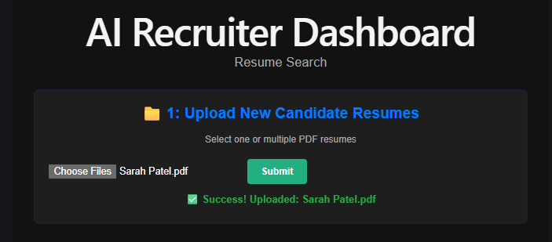
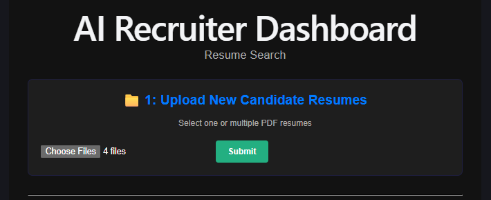
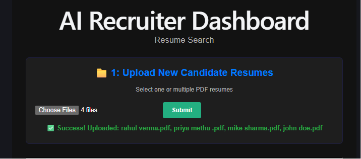
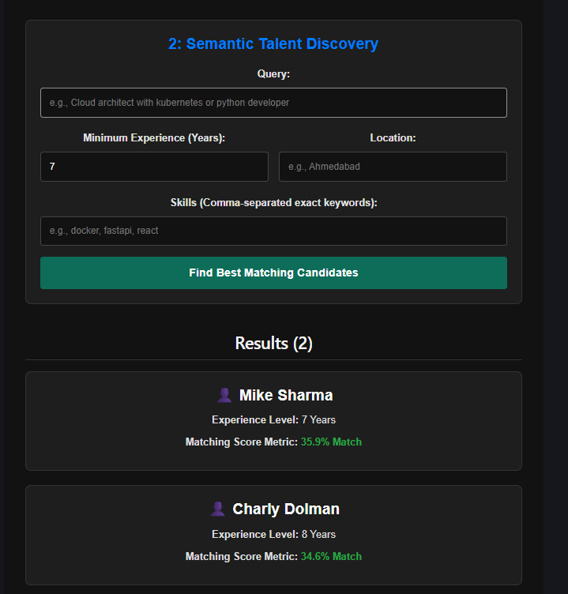

# Resume Search System

An AI-powered tool for recruiters. Upload resumes (PDF), and search them using natural language plus filters like experience, location, and skills.

## Tech Stack

- **Backend:** FastAPI, LangChain, ChromaDB, Hugging Face Embeddings, pypdf
- **Frontend:** React + Vite


## 📷 Screenshots

### Home Page



---

### multiple file uploaded 



---

### Uploaded



---

### Search & Result 



---


## Project Structure

```
resume_search/
├── app.py                 # FastAPI backend
├── requirements.txt
├── resumes/                # uploaded PDFs (not committed)
├── chroma_db/               # vector database (not committed)
├── utils/
│   ├── pdf_parser.py
│   ├── metadata_extractor.py
│   └── vector_store.py
└── frontend/
    ├── src/
    ├── public/
    └── package.json
```

## Setup

### 1. Backend

```bash
python -m venv .venv
source .venv/bin/activate        # Windows: .venv\Scripts\activate
pip install -r requirements.txt
uvicorn app:app --reload
```

Backend runs at `http://127.0.0.1:8000`
API docs at `http://127.0.0.1:8000/docs`

> **Note:** On first run, the app will automatically create `resumes/` and `chroma_db/` folders in the project root. These are gitignored and stay local — they contain uploaded candidate PDFs and the vector database, which should never be committed or pushed to a public repo.

### 2. Frontend

```bash
cd frontend
npm install
npm run dev
```

Frontend runs at `http://localhost:5173`

## API Endpoints

| Method | Endpoint  | Description                          |
|--------|-----------|---------------------------------------|
| POST   | `/upload` | Upload one or more PDF resumes        |
| POST   | `/search` | Search resumes by query + filters     |
| GET    | `/count`  | Total resumes stored                  |
| GET    | `/debug`  | Raw stored documents (for debugging)  |

### Example search request

```json
{
  "query": "Backend Developer",
  "min_experience": 3,
  "location": "Ahmedabad",
  "skills": ["Python", "FastAPI"]
}
```

## Notes

- `resumes/` and `chroma_db/` are gitignored — they contain candidate data and should never be pushed to a public repo.
- Embedding model: `all-MiniLM-L6-v2`

## Author

Twisha Savani